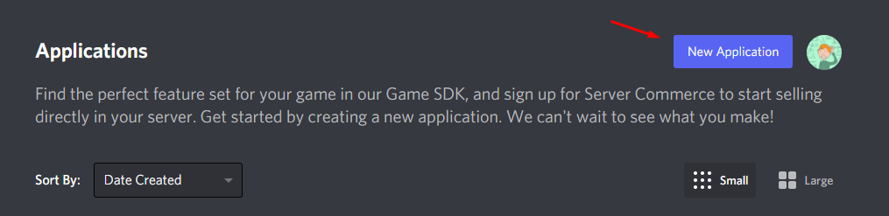
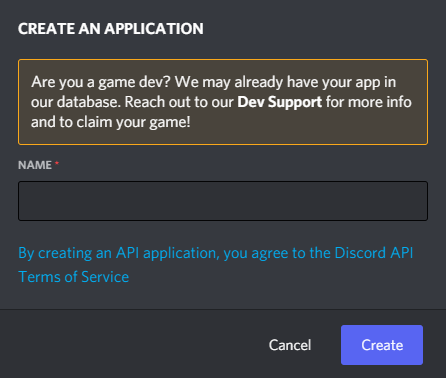
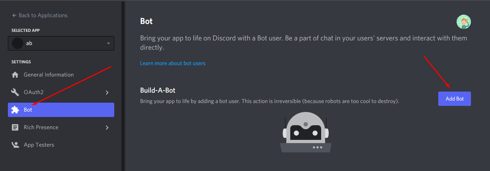
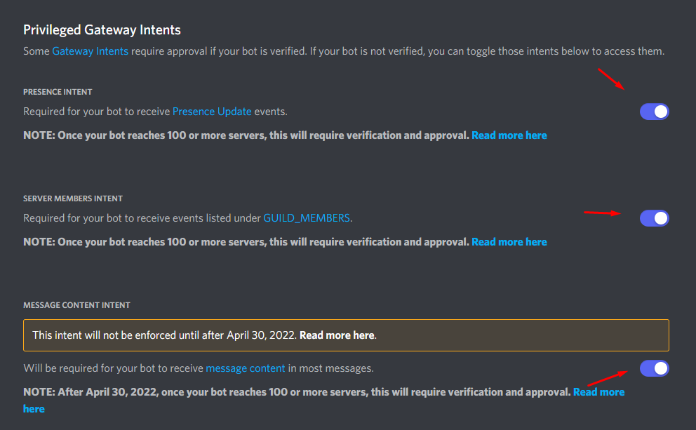
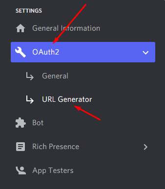
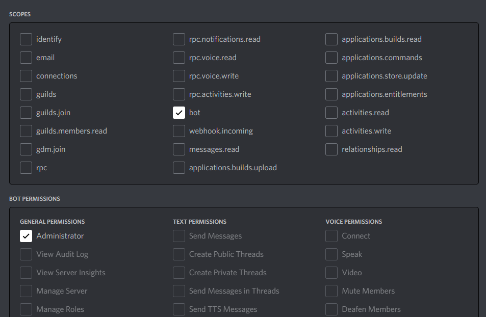
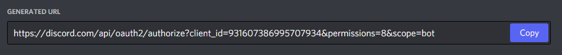

# Bot de música para discord

Este repositório guarda o código de uma aplicação que serve para ligar um bot de discord, permitindo ao usuário utilizar comandos para fazer coisas como tocar músicas e criar playlists.

## Tópicos

1. Instalação:
   1. Criação do bot;
   2. Instalação de dependências;
   3. Instalação do FFMPEG;

2. Configuração do bot.
3. Ligando o bot.

## 1. Instalação:

### 1.1 Criação do bot:

Visite <a href="https://discord.com/developers/applications">esta</a> página do discord para criar sua aplicação do discord.
Após realizar o login, se dirija ao botão de criar uma nova aplicação.

Adicione o nome do bot e clique em <strong>create</strong>.

Logo após isso, estaremos em uma nova página, no canto esquerdo clique em <strong>bot</strong> e na direita selecione </strong>add bot</strong>.

Agora na seção do canto esquerdo clique em <strong>bot</strong> e em <strong>Privileged Gateway Intents</strong> ligue todas as opções.

Agora com nosso bot criado, basta apenas adicioná-lo ao servidor desejado.
Vá até, OAuth2 --> URL Generator.

Em <strong>scopes</strong> selecione <strong>bot</strong> e em <strong>Bot permissions</strong> selecione <strong>Administrator</strong>.

Agora, na parte de baixo da página surge uma URL, clique para copiar essa URL e cole na barra de cima do navegador para que você possa adicionar o seu bot no seu servidor do discord desejado.

### 1.2 Instalação de dependências

Para que o bot funcione, um de seus pré-requisitos é ter o <a href="https://www.python.org/">python</a> instalado em máquina juntamente ao pip (gerenciador de pacotes do python), observe que para que o pip funcione corretamente o caminho do pip deve estar corretamente adicionado à variável PATH do sistema, o que por vezes não vem por padrão e o usuário deve fazer manualmente. Com o python e o pip devidamente instalados, abra e terminal e, dentro da pasta do repositório execute:

`pip install -r requirements.txt`

Com isso, o pip irá instalar todas as dependências necessárias ao devido uso da aplicação.

### 1.3 Instalação do FFMPEG

Para a instalação do FFMPEG visite o <a href="https://www.ffmpeg.org/download.html">site oficial</a> e siga o tutorial para baixar e instalar em Linux, caso esteja em Windows, tente seguir <a href="https://windowsloop.com/install-ffmpeg-windows-10/">este</a> tutorial.

## 2 Configuração do bot:

Para que seu programa reconheça o bot que você criou anteriormente basta resgatar seu token que fica no <a href="https://discord.com/developers/applications">site do discord</a>.

Na barra da esquerda clique em bot e depois na direita clique em <strong>Click to reveal token</strong>, basta copiar seu token e colar no lugar indicado dentro do arquivo .env que fica dentro da pasta app do repositório e seu bot funcionará corretamente.

Agora com o bot configurado basta executar o arquivo main.py e se tudo estiver certo o bot se mostrará ligado no servidor.

(Todos os bots de discord têm algum prefixo pelo qual os usuários podem chamá-lo, geralmente são usados caracteres especiais como !, +, $, !!, u! e etc. Por padrão este bot utiliza do $, mas você pode modificar o arquivo nomeado de config.yml que fica dentro de app/config para definir seu prefixo do bot.)
